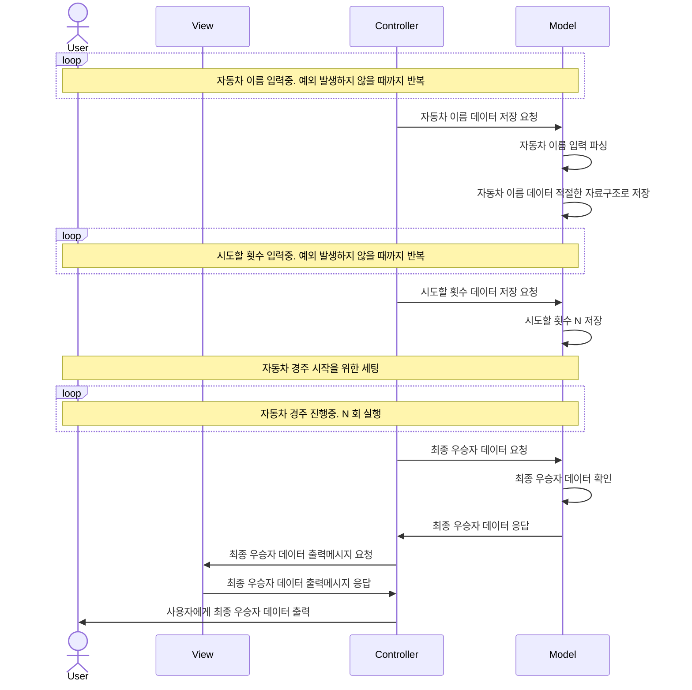
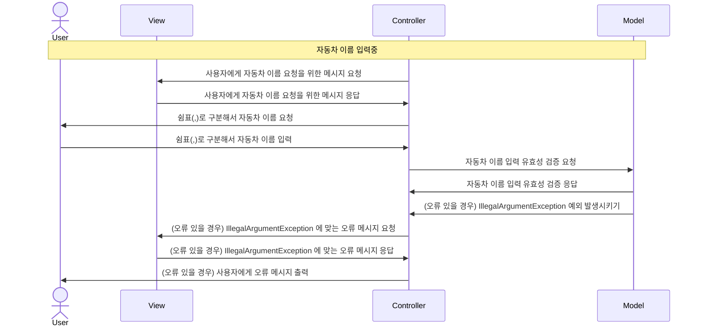
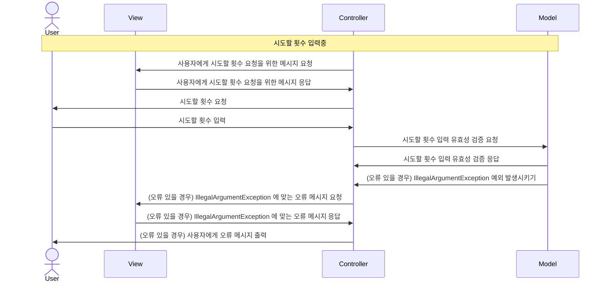
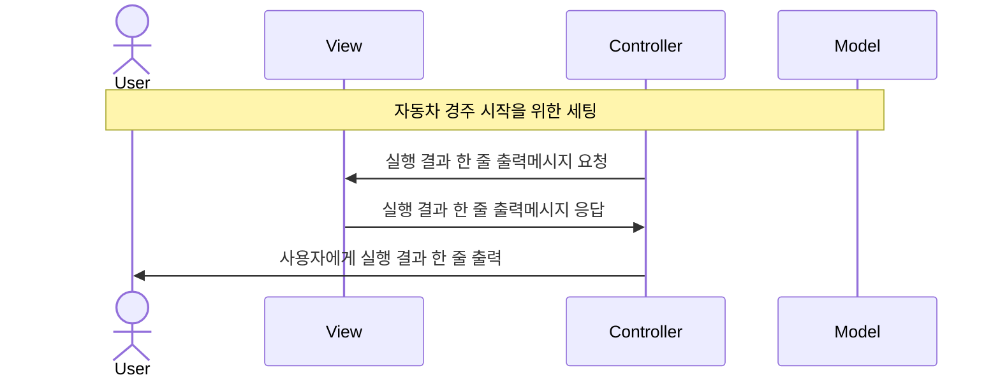
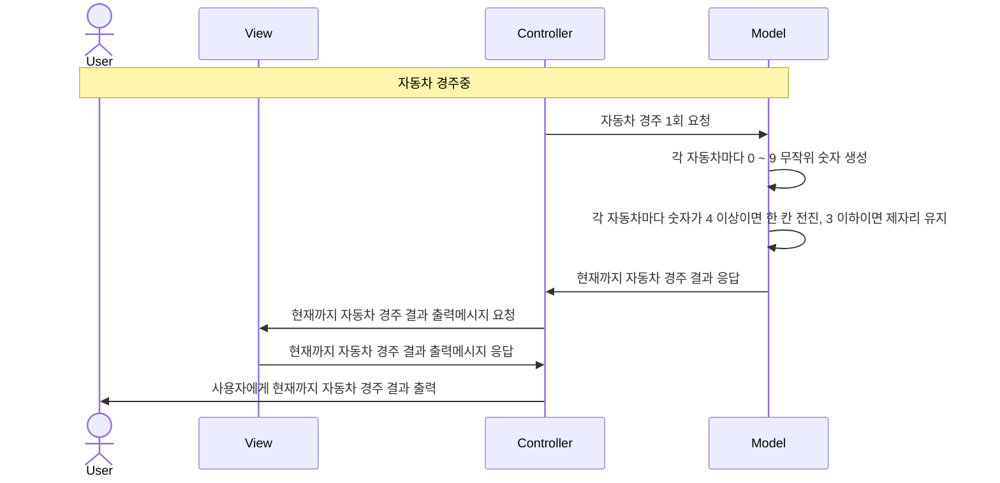

# 구현해야 하는 기능 정리

- **[input-car-names]** 사용자에게 자동차 이름 여러개 입력하라는 메시지 출력
- 사용자에게 쉼표(,)로 구분해서 여러 개의 자동차 이름을 입력 받기
- 사용자 자동차 이름 입력이 유효한지 확인
    - 유효하지 않다면 IllegalArgumentException 예외 발생시키기
    - 사용자에게 "[ERROR]" 로 시작하는 에러 메시지 출력
    - 다시 **[input-car-names]** 위치로 돌아가서 계속하기
- 방금 입력받은 자동차 이름을 내부 자료구조에 저장
- **[input-round]** 사용자에게 시도할 횟수 입력하라는 메시지 출력
- 시도할 횟수 입력이 유효한지 확인
    - 유효하지 않다면 IllegalArgumentException 예외 발생시키기
    - 사용자에게 "[ERROR]" 로 시작하는 에러 메시지 출력
    - 다시 **[input-round]** 위치로 돌아가서 계속하기
- 실행 결과 라는 메시지를 출력한다.
- 시도할 횟수 N 만큼 자동차 경주 동작을 실시한다.
- 각 자동차에 대해서 0 ~ 9 무작위 숫자를 뽑는다.
- 랜덤값이 4 이상이면 한 칸 전진하고 3 이하이면 제자리에 있는다.
- 방금 회차 경주 결과를 사용자에게 출력해서 보여준다.
- 이런식으로 N 번의 자동차 경주를 완료하고 나면 경주를 중단한다.
- 최종 우승자를 가려낸다.
- 최종 우승자가 누구인지 출력해서 보여준다.

# MVC 패턴 안에서 클래스/인터페이스 분류하기

## 프로그램 전체 플로우



## 자동차 이름 입력중 플로우



## 시도할 횟수 입력중 플로우



## 자동차 경주 시작을 위한 세팅 플로우



## 자동차 경주중 플로우



## Controller 영역에서 사용할 클래스/인터페이스

- InputAcceptor (인터페이스)
  - CarNamesInputAcceptor
  - NumberOfRoundInputAcceptor
- UserInput (인터페이스)
  - CarNamesInput: 자동차 이름 사용자 입력값
  - NumberOfRoundInput: 시도할 횟수 사용자 입력값
- MessagePrinter

## View 영역에서 사용할 클래스/인터페이스

- Message (인터페이스)
  - RequireMessage (추상클래스)
    - CarNamesRequireInputMessage: 사용자에게 자동차 이름 입력을 요청하는 메시지
    - NumberOfRoundRequireInputMessage: 사용자에게 시도할 횟수 입력을 요청하는 메시지
  - ResultMessage (추상클래스)
    - CurrentRaceResultResultMessage: 현재까지 자동차 경주 결과를 출력하는 메시지
    - FinalWinnerResultMessage: 최종 우승자를 출력하는 메시지
  - ErrorMessage (추상클래스)
    - CarNamesErrorMessage: 자동차 이름에 대한 사용자 입력이 유효하지 않을 때 출력하는 오류 메시지
    - NumberOfRoundErrorMessage: 시도할 횟수에 대한 사용자 입력이 유효하지 않을 때 출력하는 오류 메시지
  - SimpleLine (추상클래스)
    - BlankSimpleLine: 아무것도 없이 빈 줄 출력하는 메시지
    - StartOfRaceSimpleLine: 게임 시작할 때 "실행 결과" 라고 한 줄 출력하는 메시지

## Model 영역에서 사용할 클래스/인터페이스

- InputValidator (인터페이스)
  - CarNamesInputValidator
  - NumberOfRoundInputValidator
- ValidateResult (인터페이스)
  - CarNamesValidateResult: 자동차 이름 유효성 검증 결과
  - NumberOfRoundValidateResult: 시도할 횟수 유효성 검증 결과
- Delimiter (인터페이스)
  - CarNamesInputDelimiter: 자동차 이름 구분자, 쉼표(,)
  - FinalWinnerOutputDelimiter: 우승한 자동차 이름 구분자, 쉼표(,)
- InputParser (인터페이스)
  - CarNamesInputParser
  - NumberOfRoundInputParser
- ParseResult (인터페이스)
  - CarNamesInputParseResult: 자동차 이름의 배열를 저장
  - NumberOfRoundParseResult: 시도할 횟수를 저장
- RacingCarsInGame: 경주에 참여하는 모든 자동차를 저장하고 관리하는 역할
- RacingCar: 경주에 참여하는 개별 자동차
- CarName: 개별 자동차 이름
- Advance: 개별 자동차 전진 횟수
- Round (인터페이스)
  - NumberOfRound: 시도할 횟수
- RandomNumberGenerator
- GeneratedRandomNumber
- ActionSelector (인터페이스)
  - ForwardOrStayActionSelector
- ActionSelectorResult (인터페이스)
  - ForwardOrStayActionSelectorResult: 무작위 숫자에 대한 결과로 전진할지 제자리에 있을지 결정한 결과값
- FinalWinnerFactory
- FinalWinner (인터페이스)
  - SingleFinalWinner: 한 명의 최종 우승자
  - MultipleFinalWinner: 두 명 이상의 최종 우승자
- FinalWinnerName: 최종 우승자 이름

-----

# 과제 안내 PDF 내용 정리

## 기능 요구사항

- 주어진 횟수 동안 N 대의 자동차는 전진 또는 멈출 수 있다.
- 각 자동차에 이름을 부여할 수 있다. 전진하는 자동찰를 출력할 때 자동차 이름을 같이 출력한다.
- 자동차 이름은 쉼표(,)를 기준으로 구분하며 이름은 5자 이하만 가능하다.
- 사용자는 몇 번의 이동을 할 것인지를 입력할 수 있어야 한다.
- 매 라운드 사용자는 0 ~ 9 사이의 무작위 숫자를 뽑아서 전진할 지 말지 결정한다.
- 4 이상일 경우 전진하고, 3 이하일 경우 제자리에 있는다.
- 자동차 경주 게임을 완료한 후 누가 우숭했는지 알려준다.
- 우승자가 한 명 이상일 경우, 쉼표(,)로 이름을 구분해 출력한다.
- 사용자가 잘못된 값을 입력할 경우 IllegalArgumentException 을 발생시키고, "[ERROR]"로 시작하는 에러 메시지를 출력 후 그 부분부터 입력을 다시 받는다.
- Exception 이 아닌 IllegalArgumentException, IllegalStateException 등과 같은 명확한 유형을 처리한다.

## 실행 예시

```text
경주할 자동차 이름을 입력하세요.(이름은 쉼표(,) 기준으로 구분)
pobi,crong,honux
시도할 횟수는 몇회인가요?
5

실행 결과
pobi: -
crong: 
honux: -

pobi: --
crong: -
honux: --

pobi: --
crong: --
honux: ---

pobi: ---
crong: --
honux: ----

pobi: ----
crong: ---
honux: ----

최종 우승자: pobi, honux
```

## 요구사항 1 - 제약사항

- JDK 8 버전에서 정상적으로 실행할 수 있어야 한다.
- src/text/java 폴더의 baseball.ApplicationTest 에 있는 2개의 Test Case 가 성공해야 한다.

## 요구사항 2 - 제약사항

- 자바 코드 컨벤션 지키기
- indent depth 는 최대 2까지만 가능
- Stream API 사용하지 않고 구현하기 (Lambda 는 사용 가능)
- else 를 사용하지 않는다.
- 모든 함수의 길이가 10라인을 넘어가지 않도록 구현한다.
- 일급컬렉션을 활용해 구현한다.
- 모든 원시값과 문자열을 포장한다.

## 요구사항 3 - 단위 테스트

- 도메인 로직에 단위 테스트 구현
- System.out, System.in, Scanner 로직은 단위 테스트 작성하지 않는다
- 핵심 로직을 구현하는 코드와 UI를 담당하는 로직을 분리해 구현한다.
- MVC 패턴 기반으로 구현한 후 View, Controller 를 제외한 Model 에 대한 단위 테스트를 추가하는 것에 집중한다.
- JUnit5, AssertJ 라이브러리 사용
